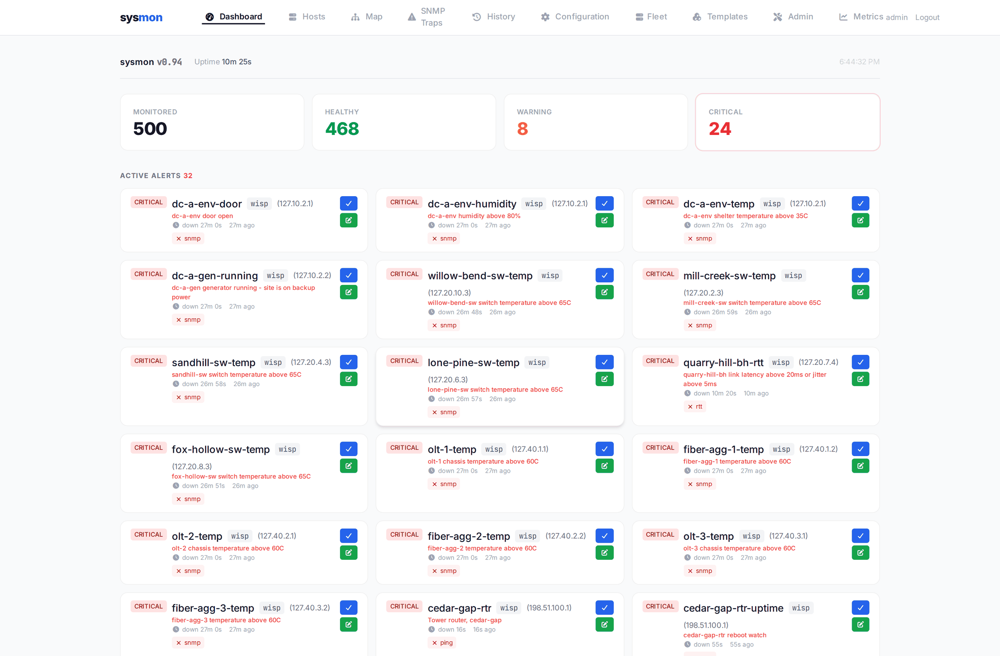
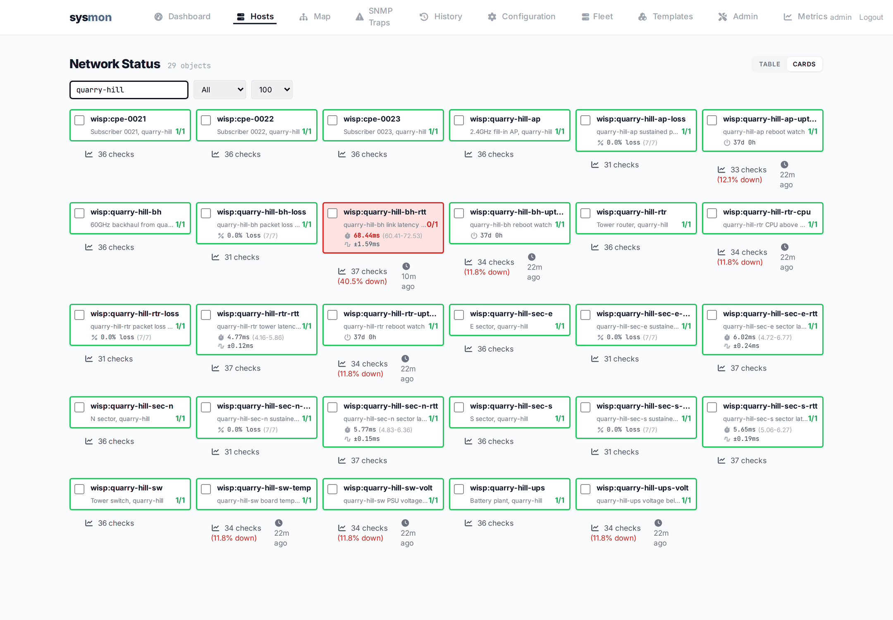
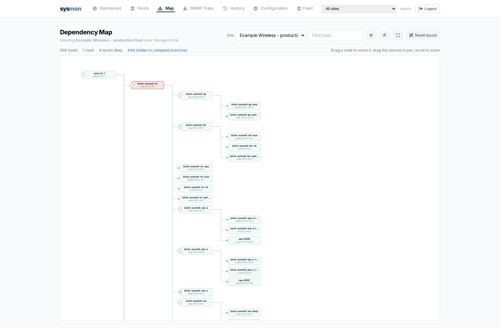
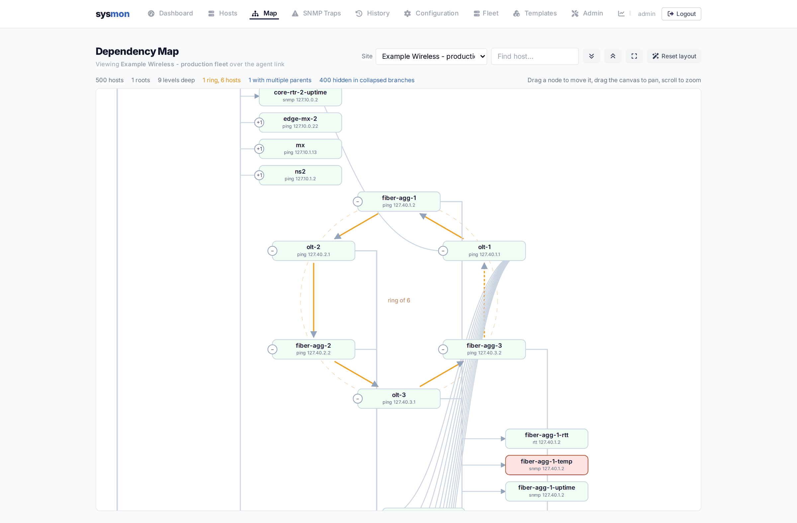
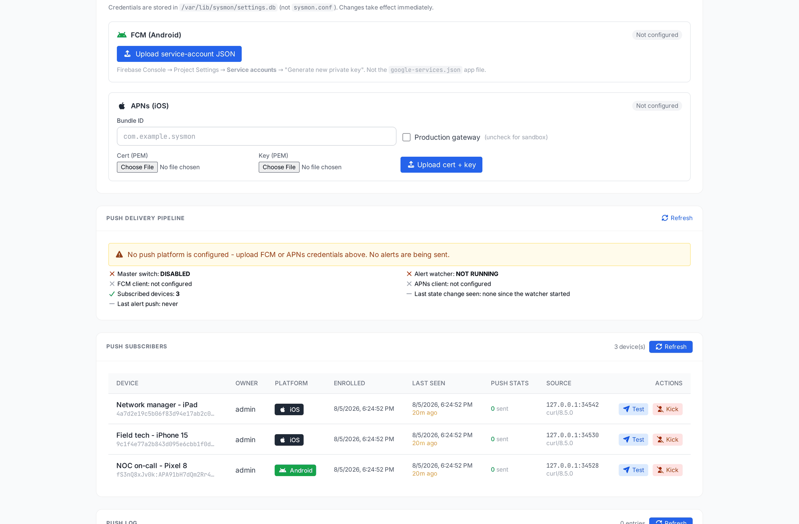
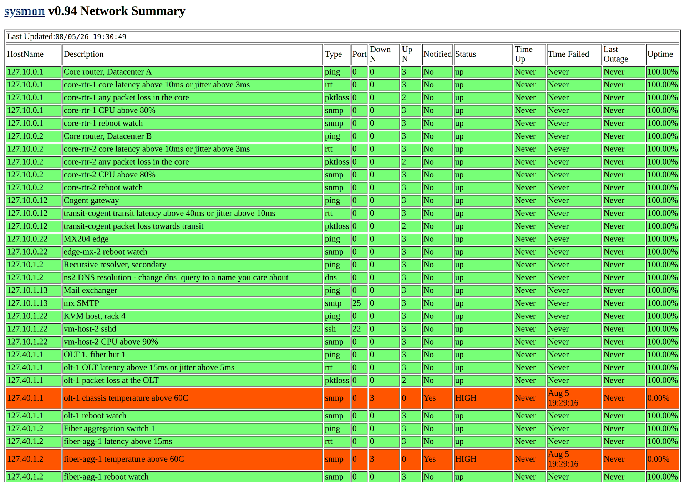

# sysmon

Network monitoring that pages you when things break - and now tells your
phone, your browser, and your history log too.

sysmon is a fast, no-nonsense network monitoring system built around a
small C daemon (`sysmond`) that has been watching networks since the
1990s. This repository is its modern era: the same battle-tested engine,
now with a live web dashboard, native Android and iOS apps, push
notifications, and CI that builds everything on every push.



Every screenshot on this page is one running system: `examples/sysmon.conf.fleet`,
a 500-object wireless ISP built entirely out of shipped device templates -
fourteen towers with their sectors, backhauls, switches and battery
plants, a PON plant, core and transit, and the environmental gear
underneath it. Two towers are on reserved address ranges that answer
nothing, which is where the red comes from.

## What's in the box

| Component | Language | What it does |
|---|---|---|
| `src/` - sysmond | C | The monitoring engine: ping/tcp/dns/http/smtp/imap/snmp checks, dependency trees, paging, SNMP traps |
| `web-ui/` - sysmon-web | Go | Web dashboard + JSON API, FastCGI (nginx/httpd) or standalone HTTP |
| `android/` | Kotlin / Compose | Native Android app |
| `ios/` | Swift / SwiftUI | Native iOS app |

## Features

### Monitoring engine (sysmond)
- Checks: ICMP ping (v4/v6, with packet-loss / RTT / jitter thresholds),
  TCP, DNS, HTTP, SMTP, IMAP, POP3, NNTP, SSH, Radius, SNMP, and more
- **No net-snmp**: sysmond speaks SNMP itself - v1/v2c GET for polling,
  v1/v2c trap decoding for what arrives on 162. That is the whole of the
  protocol it ever used, so there is no library to find, no OpenSSL on
  the link line, and no configure probe that can quietly leave you with a
  daemon that rejects every `type snmp` object. Counter64 values are read
  as 64-bit rather than guessed at, which the old net-snmp path got
  wrong. Both halves are fuzzed under ASan/UBSan, and `make check` runs a
  differential test against net-snmp's own client when you point it at an
  agent. Per-object `snmp-version "1";` for agents too old for v2c
- Dependency trees: when a router dies, its children don't page you
- Flap damping, ack/notification thresholds, per-contact schedules
- **SNMP trap reception, decoded**: v1 and v2c traps are parsed - trap
  identity, severity, vendor and every varbind - so an alert reads
  "linkDown on GigabitEthernet0/1" instead of "a trap arrived". Traps
  from unknown sources are logged too, because they are usually a device
  nobody got around to monitoring. Only packets that really are traps
  can page you; junk aimed at port 162 no longer wakes anyone
- Privilege dropping with a small setuid ping helper
- Echo replies verified by source address, not just ICMP ident - stray
  or reflected packets can't "revive" an unrelated down host
- Outage clocks survive failure-kind changes: WARNING escalating to
  CRITICAL is one outage with one start time

### Web UI (sysmon-web)
- Live dashboard: status cards, active alerts with one-click
  acknowledge, daemon state
- Hosts view: table and card layouts, search, sort, client-side
  pagination, per-host detail with check breakdown
- **Alert history**: every up/down transition from the last 48 hours,
  with how long each host spent in its previous state, filterable to
  downs-only
- **Delta protocol**: clients poll `?since=<rev>` and receive only what
  changed - a steady 300-host system transfers ~400 bytes per poll
  instead of ~150 KB
- Config editor: structured forms or raw text, with automatic backups
- Push administration: credential upload (stored in bbolt, never in
  sysmon.conf), live FCM key verification against Google, a per-device
  Test button, and a **Push Delivery Pipeline** panel that names the
  exact broken link when notifications aren't flowing
- **SNMP trap browser**: the decoded trap stream from sysmond - name,
  severity, interface, matched object, and every varbind with its MIB
  name and meaning (`ifOperStatus (down)`), filterable by source and
  severity
- Dependency map: the whole config as a graph, drag nodes into place
  (the layout is shared with every other session), right-click a host to
  add a dependent under it or stamp one out from a device template
- API metrics, session/error logs, user management with roles
- Runs as FastCGI behind nginx or OpenBSD httpd(8), or standalone with
  `-listen` for development; drops privileges after binding

#### Hosts



One tower, every object on it. A latency check exists to produce
numbers, so the card carries them: mean round trip with its min-max
range, RFC 3550 jitter, the loss ratio from the packet-loss check, and
the device's own uptime from the SNMP reboot watch. Figures are coloured
against the threshold *you* set for that object rather than a number
picked here - the backhaul in red is at 64ms against the 20ms its
template asked for.

#### Dependency map



The config as a graph, coloured live. When a tower router stops
answering, everything behind it goes with it, and sysmond pages you about
the router rather than the forty things behind it.



A ring in the config is drawn as a ring. The three fiber huts in the
example depend on each other in a loop - a cut in one span leaves every
hut reachable the other way round - so the map puts them on a circle
with their own dependencies as its rim, rather than stacking them in a
column with the lines crossing.

#### Push administration



Which phones are on the pager, when each last checked in, and a Test
button per device. The Push Delivery Pipeline panel above it names the
exact broken link when notifications are not flowing - here, honestly,
that no FCM or APNs credentials have been uploaded, so nothing is being
sent no matter how many devices are subscribed.

### Mobile apps (Android + iOS)
- Live host list and alerts driven by the delta protocol - a shared
  poller keeps one warm host map per app, patching only what changed
- **Severity-aware push notifications**: CRITICAL is loud (sound,
  heads-up, breaks through Focus on iOS); WARNING and recoveries are
  silent, shade-only. Per-host collapse keys mean one notification per
  host showing its current truth - a WARN is replaced by the CRIT that
  follows it, and by the recovery after that
- History tab: last 48 hours of transitions with durations and
  ALL / DOWNS / RECOVERIES filtering
- Alert sorting (time down / name / IP, both directions), host detail
  with admin acknowledge, paused-host and paused-daemon indicators
- Self-diagnosing notifications: the app detects blocked channels or
  disabled permissions and deep-links to the exact settings page;
  Settings offers both a local display test and a full
  server-to-Firebase round-trip test
- Sessions last as long as the app is in use (30-day sliding renewal)

### Push notification pipeline
- Android via FCM HTTP v1 (OAuth service account, uploaded through the
  admin UI)
- iOS via the same Firebase pipeline (nested `apns` payload; upload an
  APNs auth key to the Firebase console once - never expires), or
  direct cert-based APNs for Firebase-less deployments
- The server live-verifies the FCM key with Google hourly and on every
  auth failure, so a revoked key shows up as a red badge instead of
  silence

### CI - no Mac, no local SDK required
- **Android**: every push builds an installable debug APK on Linux
  runners (`.github/workflows/android.yml`)
- **iOS**: every push generates the Xcode project from
  `ios/project.yml` (XcodeGen) on GitHub's macOS runners and uploads an
  unsigned IPA, sideloadable via AltStore/Sideloadly
  (`.github/workflows/ios.yml`)
- Both runs double as the compile gate for the app code

## Aggregating several sysmonds

One sysmon-web fronts a fleet. **Daemons dial in; sysmon-web listens.**
See [Connect a sysmond to a sysmon-web](#connect-a-sysmond-to-a-sysmon-web)
below for the six steps.

sysmond **no longer listens on 1345 unless asked**. That socket was open on
every sysmond for most of the daemon's life, unauthenticated until `AUTH`,
on a process that ran as root; it is now opt-in with `config listen 1345`
(or `-p`), which is what you want if you use the `sysmon(1)` client against
a box directly.

**sysmon-web never dials a daemon.** There is one direction and one
credential: every box - including the one on localhost - dials in over TLS
and proves itself with its own token. Nothing is configured here to point
at a daemon, so nothing can point at the wrong one.

The design is in [docs/sysmond-aggregation.md](docs/sysmond-aggregation.md);
the shape of it:

- **Objects are namespaced** `site:object`. Each daemon carries a short
  `sitename` (the key, appearing in every alert and stored row) and a
  `sitedesc` (the human label the site selector shows). That qualified name
  keys alerts, history, push collapse, map layout and acknowledgements, so
  two sites' `coreswitch` never collide.
- **Anything that acts on one daemon gets a site selector** - config
  editing, the map, backups, reload. Status views aggregate across sites
  and filter optionally.
- **sysmond dials out to sysmon-web**, over TLS with a per-box token, and
  status and config share the one connection. Monitoring boxes live behind
  NAT and on management VLANs; outbound-only means no inbound firewall
  rules and no per-site VPN. A daemon that cannot reach sysmon-web keeps
  running its last known-good config and keeps paging - the monitoring
  outlives its management plane.
- **Config is distributed whole-file and validated by the target daemon's
  own parser** before it is allowed to take effect - in a forked child, so
  a config bad enough to crash the parser cannot take down the daemon that
  is still paging people. sysmon-web holds desired state, the daemon
  reports what it is actually running (`CONFIG-GEN`, one line per poll),
  and the difference is a hash comparison rather than a merge: in sync,
  pending, locally modified, unmanaged, rejected or unknown. A rejected
  delivery costs nothing - the running config is untouched until validation
  passes, and the previous files are back on disk before the reply is sent.
  A box that was edited at the console is never silently overwritten: the
  operator is offered the diff, and adopting the local version is the
  default, because the person at the console usually had a reason.
- **`/etc/sysmon.conf` is never written.** A managed box keeps its running
  copy under a directory it owns (`/var/db/sysmon`, or `config statedir`),
  created for it at startup while still root, and loads
  that instead. The seed file stays exactly as the operator wrote it, is
  what the box falls back to if that directory is emptied, and is what
  "Unmanage" returns it to. The alternative would be writing `/etc` from
  a daemon that has dropped privileges. Files are named rather than
  located: a
  delivery carries plain filenames, and the daemon decides where they go,
  so nothing an aggregator sends is ever used to build a path.
- **Rollouts are canaried.** A generation goes to one box first, and
  "applied" is not success on its own: object count and alert rate are
  watched, and a spike rolls that box back automatically and blocks the
  rest of the fleet.
- **The apps carry two independent site filters**, both defaulting to all:
  what to *show* and what to *notify about*. Someone on call for one region
  wants waking only for it, but wants to see every site when they open the
  app - whether the neighbour is also down is the first question at 3am.
  Show is a request parameter so a phone watching one site never downloads
  the rest; Notify lives on the push subscription, because that is the only
  place it can be enforced.
- **The dependency map is per site**, because `dep` cannot cross daemons.
  Several sites can share a canvas as separate clusters, but no cross-site
  edge is invented - the honest way to express one is a `type sysm` check
  against the upstream daemon.

### Connect a sysmond to a sysmon-web

sysmond dials out and sysmon-web listens. You do not open a port on the
monitored box.

**1. Start sysmon-web.** It makes a certificate on the first start and
writes the path to the log.

```
agents: using /var/lib/sysmon/agent/agent-cert.pem, valid for [localhost 127.0.0.1]
agents: listening for sysmond connections on :1347
```

The daemons must dial a name in that list. Give the other names at the
first start:

```sh
sysmon-web -agent-names sysmon-web.example.net
```

**2. Make a token for the site.** Open **Admin -> Agents & alerters ->
Add credential**. Give it a site name and a label. The page then shows the
complete set of config lines, with the token in them, and a button that
copies them. The server keeps only a hash, so it shows the token one time.

The same thing by API:

```sh
curl -b cookies -X POST https://sysmon-web.example.net/api/settings/agents \
     -H 'Content-Type: application/json' \
     -d '{"site":"metro","label":"Metro Station"}'
```

Only an administrator can reach that page or that endpoint.

**3. Paste those lines into the box's `/etc/sysmon.conf`.**

```
config sitename  "metro";
config sitedesc  "Metro Station Monitoring";
config aggregator "sysmon-web.example.net:1347";
config aggregator-token "the token from step 2";
```

**4. Copy the certificate to the box.** The page has a **CA certificate**
button. The file is also on the server, at the path the first start
logged.

```sh
ssh box mkdir -p /var/db/sysmon
scp /var/lib/sysmon/agent/agent-cert.pem box:/var/db/sysmon/aggregator-ca.pem
```

**5. Start sysmond.** The log shows the result.

```
aggregator: connected to sysmon-web.example.net:1347 as site metro
```

The box now sends its status. Its config stays read-only.

**6. Adopt the box, to manage its config.** Open the Fleet page and click
Adopt. sysmon-web then keeps a copy of the config the box is running. You
can edit and deliver it after that step, and not before.

### The same jobs from a terminal

Boxes get built by scripts, so everything the page does is a command as
well. These run and exit.

```sh
sysmon-web -mint-agent metro -agent-label "Metro Station - rack 4"
sysmon-web -list-agents
sysmon-web -revoke-agent metro
```

`-mint-agent` writes the same config lines the page shows to standard
output, and its advice to standard error, so a provisioning script can
append the first straight to the box's config. Add `-replace-agent` to
replace a live token, which stops the box holding the old one.

These open `settings.db` directly, and a running sysmon-web holds that
file. So they work with the service stopped, or on a machine where it has
never been started; while it is running, use the page.

Three things to know:

- No `config authkey` is necessary. TLS proves the server to the box, and
  the token proves the box to the server.
- Do not change `config aggregator` from the web. The editor refuses it.
  Change it on the box, where you can also put the new certificate.
- A box with no `config listen` opens no port at all.

## Quick start

`./configure && make` at the top builds the daemon, and the web UI too
if a Go toolchain is present; `make install` installs both.

### Daemon
```sh
./configure && make
make install                                              # binaries + setuid ping helper
cp examples/sysmon.conf.dist /usr/local/etc/sysmon.conf   # then edit
sysmond -f /usr/local/etc/sysmon.conf
```

`make install` is what puts `sysmon-ping-helper` in place setuid root,
mode 4750, group-owned by the identity the daemon drops to (nobody,
or daemon as the fallback) - so only the daemon can run it, not every
local user. Without it the daemon still runs, but it has no fallback
if the kernel refuses to send on a raw socket after dropping
privileges.

To start at boot: `misc/sysmond.service` (systemd) and
`misc/rc.d/sysmond` (OpenBSD rc.d) are ready to copy into place; the
web UI's counterparts are `web-ui/sysmon-web.service` and
`web-ui/rc.d/sysmon_web`. The comments at the top of each say where it
goes and what to enable. sysmond's files set no user on purpose: it
must start as root (raw ICMP sockets) and drops privileges on its own.

`examples/` also has `sysmon.conf.full`, which shows every directive, and
`sysmon.conf.fleet` - the 500-object wireless ISP in the screenshots
above. The fleet file is addressed entirely on loopback, so
`sysmond -t -f examples/sysmon.conf.fleet` validates it, and running it
gives you something to look at while you find your way around the web
UI.

### Web UI
Built and installed by the top-level `make`; on its own it is
`make web` / `make install-web`, or from `web-ui/` just `make`. Then run
it - standalone HTTP for development, a FastCGI socket for
nginx or httpd(8) in production (see `web-ui/nginx.conf.example`):
```sh
sysmon-web -listen 127.0.0.1:8180 -config /usr/local/etc/sysmon.conf -debug
```
`make dev` does the same thing without installing. Templates and static
assets are read at startup, so restart the service after `make install`.
First login is `admin` / `sysmon` - change it immediately (Admin page).
State lives in `/var/lib/sysmon` (auth, push credentials, settings,
alert history).

### Apps
Grab the latest APK / IPA from the repository's Actions artifacts, or
build locally:
- Android: drop your `google-services.json` into `android/app/`, then
  `gradle assembleDebug`
- iOS: `brew install xcodegen && cd ios && xcodegen generate`, open in
  Xcode (add `GoogleService-Info.plist` for push)

For push notifications end to end: upload your Firebase service-account
JSON on the Admin page, enable the push toggle, and check the Push
Delivery Pipeline panel - it will tell you what, if anything, is
missing.

## sysmond on its own

None of the above is required. `sysmond` writes its own status page, and
has since long before any of it existed:

```
config statusfile html "/var/www/htdocs/index.html";
config showupalso;          # without this, only what is down is listed
```



The same 500-object fleet, written by the daemon itself. One file, no
JavaScript, no CDN, no web server beyond whatever already serves that
directory - point Apache or httpd(8) at it, or open it off a filesystem.
Green is up, orange is down, yellow is a recent change, and the page
refreshes itself on a meta tag. There is a `text` variant of the same
directive for a terminal.

The page keeps working when sysmon-web is stopped, upgraded, or was
never installed.

## History

sysmon was written by Jared Mauch and has monitored real networks for
nearly three decades. The docs/ directory preserves the original
documentation; docs/CHANGES tracks the long arc. Same engine, new era.
